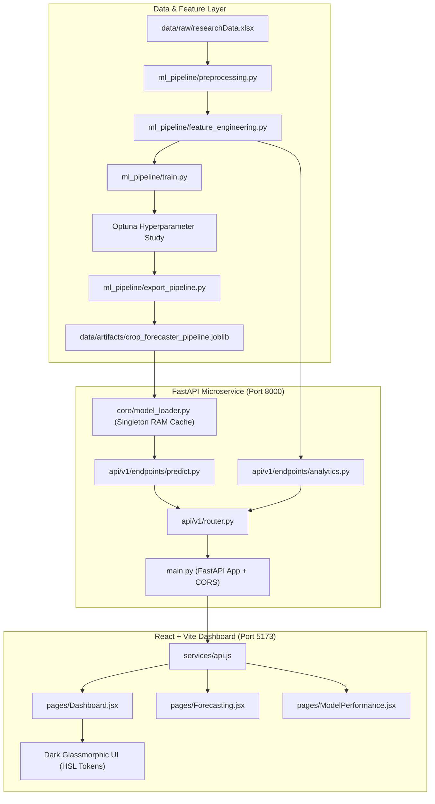

# CropForecastLK Architecture & System Flow

```mermaid
flowchart TD
    subgraph Data_Layer ["Data & Feature Layer"]
        RAW["data/raw/researchData.xlsx"] --> CLEAN["ml_pipeline/preprocessing.py"]
        CLEAN --> FEAT["ml_pipeline/feature_engineering.py"]
        FEAT --> TRAIN["ml_pipeline/train.py"]
        TRAIN --> OPTUNA["Optuna Hyperparameter Study"]
        OPTUNA --> EXPORT["ml_pipeline/export_pipeline.py"]
        EXPORT --> ARTIFACT["data/artifacts/crop_forecaster_pipeline.joblib"]
    end

    subgraph Backend_Layer ["FastAPI Microservice (Port 8000)"]
        ARTIFACT --> LOADER["core/model_loader.py (Singleton RAM Cache)"]
        LOADER --> PREDICT_API["api/v1/endpoints/predict.py"]
        FEAT --> ANALYTICS_API["api/v1/endpoints/analytics.py"]
        PREDICT_API --> ROUTER["api/v1/router.py"]
        ANALYTICS_API --> ROUTER
        ROUTER --> FASTAPI["main.py (FastAPI App + CORS)"]
    end

    subgraph Frontend_Layer ["React + Vite Dashboard (Port 5173)"]
        FASTAPI --> AXIOS["services/api.js"]
        AXIOS --> DASHBOARD["pages/Dashboard.jsx"]
        AXIOS --> FORECAST["pages/Forecasting.jsx"]
        AXIOS --> MODEL_PERF["pages/ModelPerformance.jsx"]
        DASHBOARD --> UI["Dark Glassmorphic UI (HSL Tokens)"]
    end
```
