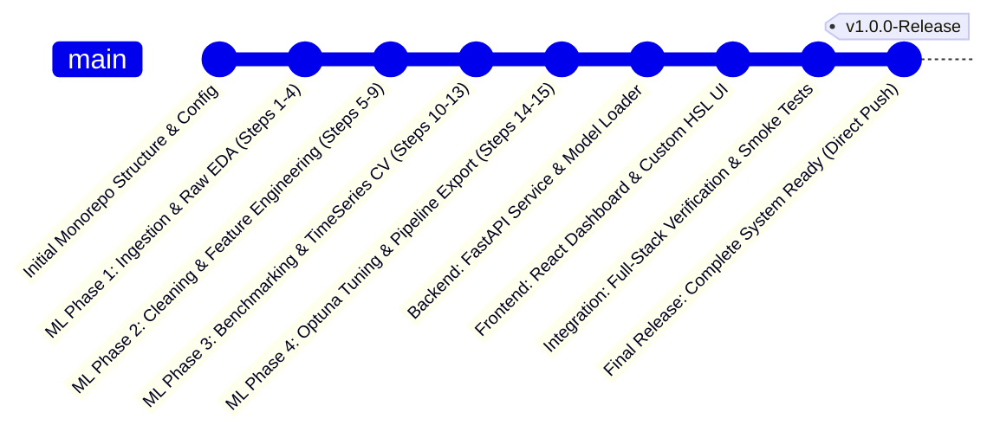
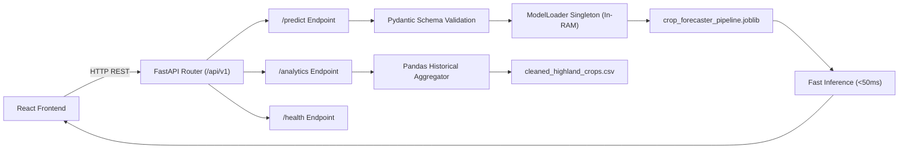

# CropForecastLK: Solo Master Implementation Plan
## Sri Lanka Highland Crops Production Forecasting & Agricultural Intelligence System

> **Academic Module**: Machine Learning Development & Full-Stack Application  
> **Final Submission Deadline**: 18th September 2026  
> **Target Domain**: Sri Lankan Highland Agricultural Crop Production & Yield Forecasting  
> **Execution Model**: Solo Developer Implementation (End-to-End Ownership)  
> **Repository Strategy**: Single Branch (`main`), Direct Linear Git Progression & Direct Push  

---

## 1. Executive Summary & Project Scope

**CropForecastLK** is an end-to-end machine learning system and full-stack web intelligence platform designed to forecast seasonal crop production and agricultural yield across Sri Lanka's highland districts (e.g., Nuwara Eliya, Badulla, Kandy, Matale, and Moneragala). Utilizing over two decades (2000–2023) of historical agricultural data from Sri Lanka's Department of Census and Statistics (94,755 records across highland crops including Kurakkan, Maize, Green Gram, Chili, Potato, Sweet Potato, and Cassava), the system addresses seasonal supply fluctuations, food security planning, and climate-induced yield volatility.

As an individual engineer undertaking this project from start to finish, you are solely responsible for:
1. **Data Engineering & Ingestion**: Parsing raw multi-sheet agricultural census records, sanitizing mixed-type formatting, handling missing values, and engineering temporal features.
2. **Machine Learning Pipeline**: Implementing a rigorous 15-step ML workflow—from exploratory data analysis (EDA) and time-series cross-validation to multi-model benchmarking (Ridge, Random Forest, LightGBM, CatBoost, XGBoost) and Optuna hyperparameter tuning.
3. **Pipeline Serialization**: Bundling preprocessing transforms, encoders, and the champion estimator into a production-grade Scikit-Learn pipeline.
4. **Backend Microservice**: Engineering a high-performance asynchronous REST API using FastAPI with singleton model inference loading and analytics endpoints.
5. **Interactive Frontend Dashboard**: Developing a modern, responsive React + Vite web dashboard styled with custom vanilla CSS (HSL design tokens, dark aesthetic, glassmorphism, and Recharts interactive visualizations).
6. **Direct Git Delivery**: Executing the entire lifecycle on a single `main` branch with structured, atomic milestone commits, pushing the complete project directly to GitHub upon completion.

---

## 2. Monorepo Architecture

The repository is structured as a unified monorepo that encapsulates the data assets, experimental Jupyter notebooks, modular Python ML package, FastAPI backend microservice, and React frontend dashboard.

```text
CropsForecastLK/
├── data/
│   ├── raw/
│   │   └── researchData.xlsx         # Original Department of Census & Statistics dataset (94,755 records)
│   ├── processed/
│   │   ├── cleaned_highland_crops.csv# Sanitized dataset (commas removed, aggregate rows filtered)
│   │   └── engineered_features.parquet # Feature-engineered dataset ready for ML modeling
│   └── artifacts/
│       ├── crop_forecaster_pipeline.joblib # Serialized Scikit-Learn/XGBoost inference pipeline
│       ├── optuna_study_best_params.json   # Optimal hyperparameters discovered by Optuna
│       └── model_metadata.json             # Feature schema, target encoding maps, and test metrics
├── docs/
│   ├── architecture_diagram.png     # System architecture overview
│   ├── dataset_dictionary.md         # Field definitions, units, and data types
│   └── Machine_Learning_Module_Assignment.pdf # Academic guidelines
├── ml_pipeline/
│   ├── __init__.py
│   ├── config.py                     # Global paths, random seeds, and target definitions
│   ├── data_ingestion.py             # Excel reader and raw schema validator
│   ├── preprocessing.py              # Comma-string converter, scaler, and outlier cleaner
│   ├── feature_engineering.py        # Lag features, yield ratio, rolling stats, and target encoding
│   ├── evaluate.py                   # Metrics calculation (RMSE, MAE, R², MAPE) and residual plots
│   ├── train.py                      # Multi-model benchmarking, K-Fold CV, and Optuna runner
│   └── export_pipeline.py            # Packaging transformers and estimator into joblib pipeline
├── notebooks/
│   ├── 01_problem_definition_and_eda.ipynb   # Steps 1-4: Problem Framing, Ingestion & Raw/Geographic EDA
│   ├── 02_cleaning_and_feature_engineering.ipynb # Steps 5-9: Cleaning, Imputation, Feature Eng & Splitting
│   ├── 03_benchmarking_crossval_evaluation.ipynb # Steps 10-13: 5 Models, TimeSeries CV, Metrics & SHAP
│   ├── 04_optuna_tuning_pipeline_export.ipynb    # Steps 14-15: Optuna Tuning & Production Serialization
│   └── CropForecastLK_Master_Pipeline.ipynb     # Consolidated end-to-end master notebook
├── backend/
│   ├── app/
│   │   ├── api/
│   │   │   ├── v1/
│   │   │   │   ├── endpoints/
│   │   │   │   │   ├── predict.py   # Single & batch harvest forecasting endpoints
│   │   │   │   │   ├── analytics.py # Historical district trends & yield statistics
│   │   │   │   │   └── health.py    # Service health & model status
│   │   │   │   └── router.py        # API router registration
│   │   ├── core/
│   │   │   ├── config.py            # Pydantic environment settings
│   │   │   └── model_loader.py      # Singleton loader for joblib ML artifact
│   │   ├── schemas/
│   │   │   └── prediction.py        # Pydantic request/response validation schemas
│   │   └── main.py                  # FastAPI application entry point & CORS configuration
│   ├── tests/
│   │   ├── test_predict_api.py      # Unit tests for inference API
│   │   └── test_ml_integration.py   # Integration tests verifying loaded model output
│   ├── Dockerfile                   # Container definition for backend
│   └── requirements.txt             # Python runtime dependencies
├── frontend/
│   ├── src/
│   │   ├── assets/                  # Sri Lankan agricultural icons and images
│   │   ├── components/
│   │   │   ├── Navbar.jsx           # Glassmorphism header & navigation
│   │   │   ├── PredictorCard.jsx    # Interactive prediction form (district, crop, extent, season)
│   │   │   ├── DistrictMap.jsx      # Sri Lanka district selector & visual summary
│   │   │   ├── MetricsOverview.jsx  # KPI cards (extent, historical production, predicted yield)
│   │   │   └── AnalyticsChart.jsx   # Recharts visualization of seasonal trends (Yala vs Maha)
│   │   ├── pages/
│   │   │   ├── Dashboard.jsx        # Main overview dashboard
│   │   │   ├── Forecasting.jsx      # Deep ML prediction engine interface
│   │   │   └── ModelPerformance.jsx # Model benchmarking metrics & Optuna parameter insights
│   │   ├── services/
│   │   │   └── api.js               # Axios instance for backend REST communication
│   │   ├── App.jsx                  # Root React component
│   │   └── index.css                # Custom CSS design system (HSL color tokens, dark glassmorphism)
│   ├── package.json                 # Node dependencies
│   └── vite.config.js               # Vite build configuration
├── .gitignore
├── README.md                        # Master repository documentation
├── implementation_plan.md           # Original multi-member implementation plan (preserved)
└── implementation_plan_solo.md      # Solo developer master implementation plan
```

---

## 3. Solo Linear Git Workflow & Direct Push Strategy

Because you are working as a solo engineer, branching overhead (creating separate feature branches, switching context, writing pull requests, resolving merge conflicts) is completely eliminated. All development takes place directly on the `main` branch with structured, atomic milestone commits. Once the entire system is built, verified, and benchmarked, it is pushed directly to the remote Git repository in one final operation.



### Git Command Recipe for Solo Execution

Execute the following sequence on your local terminal. All work is committed locally at logical checkpoints, and pushed to the remote repository once the entire implementation is complete.

```bash
# 1. Initialize local repository (if not already initialized) and verify on main
git checkout -b main 2>/dev/null || git checkout main

# 2. Checkpoint 1: Ingestion & Raw Exploratory Data Analysis
git add data/raw/ notebooks/01_problem_definition_and_eda.ipynb ml_pipeline/data_ingestion.py
git commit -m "feat(ml): ingest raw researchData.xlsx, profile schemas, and complete seasonal EDA"

# 3. Checkpoint 2: Data Cleaning, Preprocessing & Feature Engineering
git add notebooks/02_cleaning_and_feature_engineering.ipynb ml_pipeline/preprocessing.py ml_pipeline/feature_engineering.py
git commit -m "feat(ml): implement regex string cleaning, group median imputation, yield ratios, and lag features"

# 4. Checkpoint 3: Model Benchmarking, Time-Series CV & Residual Diagnostics
git add notebooks/03_benchmarking_crossval_evaluation.ipynb ml_pipeline/train.py ml_pipeline/evaluate.py
git commit -m "feat(ml): benchmark 5 regression models, setup time-series CV, and run SHAP residual analysis"

# 5. Checkpoint 4: Optuna Optimization & Pipeline Packaging
git add notebooks/04_optuna_tuning_pipeline_export.ipynb ml_pipeline/export_pipeline.py data/artifacts/
git commit -m "feat(ml): optimize XGBoost via Optuna, serialize joblib pipeline, and export model metadata"

# 6. Checkpoint 5: FastAPI Backend Microservice
git add backend/
git commit -m "feat(backend): implement FastAPI prediction service, model loader singleton, and analytics endpoints"

# 7. Checkpoint 6: React + Vite Frontend Dashboard
git add frontend/
git commit -m "feat(frontend): create React intelligence dashboard, custom HSL design system, and Recharts analytics"

# 8. Checkpoint 7: Final Documentation, Master Notebook & Smoke Tests
git add notebooks/CropForecastLK_Master_Pipeline.ipynb docs/ README.md implementation_plan_solo.md
git commit -m "docs: finalize master pipeline notebook, architecture documentation, and solo implementation plan"

# 9. Direct Push to Remote Repository (Once Everything Is Completed)
git push -u origin main
```

---

## 4. End-to-End Solo Implementation Roadmap

The project is structured into **7 sequential phases** executed end-to-end by one engineer:

| Phase | Core Objective | Key Deliverables | Estimated Duration |
| :--- | :--- | :--- | :--- |
| **Phase 1** | Problem Formulation & Raw Data Profiling | Ingestion script (`data_ingestion.py`), raw audit, seasonal EDA notebook (`01_problem_definition_and_eda.ipynb`) | Day 1 (Morning) |
| **Phase 2** | Data Cleaning & Feature Engineering | Regex string parser, median imputer, lag/yield features, temporal splitter (`02_cleaning_and_feature_engineering.ipynb`) | Day 1 (Afternoon) |
| **Phase 3** | Model Benchmarking & Validation | 5-model comparative harness, TimeSeries CV, evaluation metrics, SHAP residual analysis (`03_benchmarking_crossval_evaluation.ipynb`) | Day 2 (Morning) |
| **Phase 4** | Hyperparameter Optimization & Packaging | Optuna 50-trial study, Scikit-Learn `Pipeline` serialization (`crop_forecaster_pipeline.joblib`), metadata export (`04_optuna_tuning_pipeline_export.ipynb`) | Day 2 (Afternoon) |
| **Phase 5** | Backend Microservice Development | FastAPI app, singleton model loader, `/predict` and `/analytics` endpoints, Pydantic schemas, unit tests | Day 3 (Morning) |
| **Phase 6** | Frontend Dashboard Development | React + Vite UI, custom HSL CSS design system, glassmorphic cards, district map selector, Recharts seasonal graphs | Day 3 (Afternoon) |
| **Phase 7** | System Integration, Verification & Direct Push | End-to-end smoke tests, master notebook verification, final commit, and direct push to GitHub | Day 4 |

---

## 5. Detailed 15-Step Machine Learning Pipeline

The agricultural dataset `researchData.xlsx` spans **94,755 time-series records** from Sri Lanka's Department of Census and Statistics. Below is the comprehensive step-by-step implementation guide covering all 15 stages of the ML lifecycle.

```mermaid
flowchart TD
    subgraph Ingestion_and_EDA ["Phase 1: Ingestion & EDA"]
        S1["Step 1: Problem Definition"] --> S2["Step 2: Automated Ingestion"]
        S2 --> S3["Step 3: Descriptive Raw EDA"]
        S3 --> S4["Step 4: Seasonal & Geographic EDA"]
    end

    subgraph Preprocessing_and_Features ["Phase 2: Cleaning & Features"]
        S4 --> S5["Step 5: Regex String Cleaning"]
        S5 --> S6["Step 6: Outlier Handling & Imputation"]
        S6 --> S7["Step 7: Yield & Lag Feature Eng"]
        S7 --> S8["Step 8: Target Encoding & Transforms"]
        S8 --> S9["Step 9: Temporal Splitting (2000-2017 / 2018-2020 / 2021-2023)"]
    end

    subgraph Modeling_and_Evaluation ["Phase 3: Modeling & Evaluation"]
        S9 --> S10["Step 10: 5-Model Benchmarking"]
        S10 --> S11["Step 11: Time-Series Cross-Validation"]
        S11 --> S12["Step 12: Metric Calculation (RMSE, MAE, R², MAPE)"]
        S12 --> S13["Step 13: Residual Analysis & SHAP Diagnostics"]
    end

    subgraph Optimization_and_Packaging ["Phase 4: Optimization & Packaging"]
        S13 --> S14["Step 14: Optuna Hyperparameter Tuning (50 Trials)"]
        S14 --> S15["Step 15: Pipeline Packaging & joblib Export"]
    end

    subgraph Serving_and_UI ["Phases 5-7: Full-Stack & Delivery"]
        S15 --> BE["Phase 5: FastAPI Backend Service"]
        BE --> FE["Phase 6: React + Vite Dashboard"]
        FE --> PUSH["Phase 7: End-to-End Verification & Direct Push to Git"]
    end
```



### Step 1: Problem Definition & Domain Context
- **Task**: Formulate highland crop production forecasting as a supervised multivariate regression problem.
- **Agricultural Dynamics**:
  - **Maha Season**: North-East Monsoon (September to March)—primary agricultural season with higher precipitation and cultivated extent.
  - **Yala Season**: South-West Monsoon (May to August/September)—secondary season prone to dry spells in specific rain-shadow districts.
- **Target Variables**:
  - Primary Target: `Production` (Metric Tons, MT).
  - Secondary Target: `Crop_Yield` (Metric Tons per Hectare, MT/Ha).
- **Core Features**: `District`, `Season`, `CropCategory`, `Crop`, `Year`, `Extent` (Hectares cultivated).

### Step 2: Automated Data Ingestion & Raw Data Audit
- **Task**: Programmatically load `researchData.xlsx` (94,755 rows $\times$ 7 columns) using `pandas` and `openpyxl`.
- **Validation Routine**: Check column naming conventions, verify row counts, inspect memory usage, and validate data types.
- **Key Insight**: Raw numerical columns (`Extent`, `Production`) are loaded as `object` (string) datatypes due to comma thousands-separators, hyphens (`-`), and `"n.a."` text placeholders.

### Step 3: Descriptive Raw EDA & Distribution Profiling
- **Task**: Compute initial descriptive statistics on raw distributions.
- **Key Findings**:
  - Severe positive skewness in both `Extent` and `Production`.
  - Presence of zero-extent rows (`Extent == 0`).
  - High percentage of missing values disguised as string characters (`"-"`, `"n.a."`, `" "` whitespace).

### Step 4: Seasonal Monsoonal & Geographic EDA
- **Task**: Visualize regional crop dynamics across key highland districts: Nuwara Eliya, Badulla, Kandy, Matale, Moneragala.
- **Visualizations**:
  - Boxplots comparing Maha vs. Yala yield across highland crops (Potato, Maize, Kurakkan).
  - Geographic production distribution bar charts.
  - Anomaly detection: Identification of non-district summary rows embedded directly in the dataset (e.g., `"Island Total"`, `"National Total"`).

### Step 5: Data Schema Audit & Regex String Cleaning Parser
- **Task**: Build a robust regex cleaning pipeline to convert formatted strings into standard float numbers.
- **Implementation**:
  ```python
  import re
  import numpy as np
  import pandas as pd

  def clean_numeric_string(val):
      if pd.isna(val):
          return np.nan
      val_str = str(val).strip()
      if val_str in ["-", "n.a.", "nan", "", "None"]:
          return np.nan
      # Strip out commas and non-numeric chars except decimal point
      clean_str = re.sub(r"[^\d.]", "", val_str)
      try:
          return float(clean_str)
      except ValueError:
          return np.nan

  def filter_aggregate_rows(df: pd.DataFrame) -> pd.DataFrame:
      aggregates = ["island total", "national total", "total", "all districts"]
      return df[~df["District"].astype(str).str.lower().str.strip().isin(aggregates)].copy()
  ```

### Step 6: Extreme Outlier Handling & Group Median Imputation
- **Task**: Remove impossible agricultural anomalies and impute missing values using localized domain medians.
- **Rules**:
  1. If `Extent == 0` and `Production > 0`: Impossible biological state (production without land); set `Production = np.nan`.
  2. If `Extent > 0` and `Production == 0`: Valid crop failure scenario; preserve as 0.
  3. Groupwise median imputation: Group by `['District', 'Crop', 'Season']` and impute missing `Extent` and `Production` with the median of that specific cohort. If the entire cohort is empty, fall back to the crop-level global median.

### Step 7: Domain Yield Ratio & Temporal Lag Feature Engineering
- **Task**: Derive domain-specific agronomic features and time-series memory.
- **Engineered Features**:
  1. **Yield Ratio**:
     $$\text{Crop\_Yield} = \frac{\text{Production}}{\text{Extent}}$$
  2. **1-Year Temporal Lags**:
     - `Production_Lag_1Y`: Production of the same crop in the same district and season 1 year prior.
     - `Yield_Lag_1Y`: Yield ratio from 1 year prior.
  3. **3-Year Rolling Window Statistics**:
     - `Extent_RollMean_3Y`: 3-year rolling mean of cultivated extent (captures land allocation trends).
     - `Extent_RollStd_3Y`: 3-year rolling standard deviation (captures cultivation volatility).

### Step 8: Target Encoding, One-Hot Encoding & Transformations
- **Task**: Encode high-cardinality categorical variables and normalize skewed distributions without causing data leakage.
- **Encodings**:
  - **District & Crop**: Out-of-fold smoothed target encoding:
    $$\hat{S}_i = \frac{n \cdot \bar{y}_{\text{category}} + m \cdot \bar{y}_{\text{global}}}{n + m}$$
    where $m = 10$ (smoothing weight) and $n$ is sample count.
  - **Season**: Binary One-Hot Encoding (`Season_Maha` = 1, `Season_Yala` = 0).
  - **Target Normalization**: Apply $\log(1 + y)$ transformation to `Production` to stabilize variance across high-volume crops (Cassava, Potato) and low-volume crops (Green Gram).

### Step 9: Dataset Splitting & Temporal Validation Setup
- **Task**: Establish a strict chronological train/validation/test split to mirror real-world agricultural forecasting and eliminate future-to-past data leakage.
- **Split Boundaries**:
  - **Training Set (2000–2017)**: 18 years of historical cultivation records for model fitting.
  - **Validation Set (2018–2020)**: 3 years used for hyperparameter evaluation and early stopping.
  - **Holdout Test Set (2021–2023)**: 3 years strictly reserved for final out-of-sample benchmarking.

### Step 10: Multi-Model Baseline Benchmarking
- **Task**: Build a standardized evaluation harness and benchmark 5 diverse regression algorithms on the temporal training/validation sets.
- **Candidate Models**:
  1. **Linear / Ridge Regression**: Regularized parametric baseline.
  2. **Random Forest Regressor**: Non-linear bagging ensemble robust to outliers.
  3. **CatBoost Regressor**: Gradient boosting with native categorical handling.
  4. **LightGBM Regressor**: Fast leaf-wise tree boosting optimized for tabular data.
  5. **XGBoost Regressor**: Depth-wise gradient boosted trees with $L_1$ and $L_2$ regularization.
- **Tracking**: Log training time, inference latency, memory footprint, and baseline RMSE/MAE for each model.

### Step 11: Time-Series Cross-Validation Framework
- **Task**: Implement a 5-fold expanding-window cross-validation strategy (`TimeSeriesSplit` across the `Year` dimension).
- **Validation Protocol**:
  - Fold 1: Train (2000–2005) $\rightarrow$ Validate (2006–2008)
  - Fold 2: Train (2000–2008) $\rightarrow$ Validate (2009–2011)
  - Fold 3: Train (2000–2011) $\rightarrow$ Validate (2012–2014)
  - Fold 4: Train (2000–2014) $\rightarrow$ Validate (2015–2017)
  - Fold 5: Train (2000–2017) $\rightarrow$ Validate (2018–2020)
- **Goal**: Measure performance variance and stability across shifting climate patterns.

### Step 12: Standardized Evaluation Metrics Calculation
- **Task**: Compute primary and secondary regression evaluation metrics across all temporal test slices:
  - **Root Mean Squared Error (RMSE)**:
    $$\text{RMSE} = \sqrt{\frac{1}{N}\sum_{i=1}^N (y_i - \hat{y}_i)^2}$$
  - **Mean Absolute Error (MAE)**:
    $$\text{MAE} = \frac{1}{N}\sum_{i=1}^N |y_i - \hat{y}_i|$$
  - **Coefficient of Determination ($R^2$)**:
    $$R^2 = 1 - \frac{\sum (y_i - \hat{y}_i)^2}{\sum (y_i - \bar{y})^2}$$
  - **Mean Absolute Percentage Error (MAPE)**:
    $$\text{MAPE} = \frac{100\%}{N}\sum_{i=1}^N \left|\frac{y_i - \hat{y}_i}{y_i}\right| \quad (\text{for } y_i > 0)$$

### Step 13: Residual Analysis & Diagnostic Error Profiling (SHAP)
- **Task**: Audit model predictions to detect systematic bias across districts and crops.
- **Diagnostics**:
  - Residual vs. Predicted scatter plots: Confirm error homoscedasticity around zero.
  - Normal Q-Q plots: Verify residual normality.
  - **SHAP (SHapley Additive exPlanations)**: Compute TreeSHAP values for the top ensemble model to quantify the global and local contribution of `Extent`, `Yield_Lag_1Y`, `District`, and `Season`.

### Step 14: Optuna Hyperparameter Optimization
- **Task**: Run an automated 50-trial hyperparameter optimization study targeting minimum cross-validated RMSE on the champion algorithm (XGBoost / LightGBM).
- **Search Space**:
  ```python
  def objective(trial):
      params = {
          "n_estimators": trial.suggest_int("n_estimators", 100, 1000, step=50),
          "max_depth": trial.suggest_int("max_depth", 3, 10),
          "learning_rate": trial.suggest_float("learning_rate", 0.01, 0.2, log=True),
          "subsample": trial.suggest_float("subsample", 0.6, 1.0),
          "colsample_bytree": trial.suggest_float("colsample_bytree", 0.6, 1.0),
          "reg_alpha": trial.suggest_float("reg_alpha", 1e-3, 10.0, log=True),
          "reg_lambda": trial.suggest_float("reg_lambda", 1e-3, 10.0, log=True),
      }
      # Evaluate via 5-fold TimeSeriesSplit and return average RMSE
      return cv_rmse_score
  ```
- **Pruning & Visualization**: Use Optuna's `TPESampler` paired with `MedianPruner`; generate parameter importance and slice plots saved to `docs/`.

### Step 15: Production Pipeline Packaging & Artifact Export
- **Task**: Encapsulate data preprocessing, target encodings, and the tuned estimator into a single Scikit-Learn `Pipeline`.
- **Exported Artifacts**:
  1. `data/artifacts/crop_forecaster_pipeline.joblib`: Serialized inference pipeline capable of taking raw input dictionaries and outputting predicted production in MT.
  2. `data/artifacts/optuna_study_best_params.json`: Optimal hyperparameter configuration.
  3. `data/artifacts/model_metadata.json`: Feature input schema, district/crop categorical mappings, training timestamp, and final evaluation test metrics ($R^2$, RMSE, MAE).

---

## 6. Backend Microservice Architecture (FastAPI)

The backend is built as an asynchronous REST service using **FastAPI** to serve real-time predictions and historical analytics to the frontend.



### Backend Components
1. **Model Loader Singleton (`backend/app/core/model_loader.py`)**:
   - Loads `crop_forecaster_pipeline.joblib` and `model_metadata.json` once upon application startup (`@app.on_event("startup")`).
   - Keeps the model in memory to guarantee low-latency inference ($<50\text{ms}$).
2. **Pydantic Validation Schemas (`backend/app/schemas/prediction.py`)**:
   - `PredictionRequest`: Validates input fields (`district`, `season`, `crop`, `extent_ha`, `year`).
   - `PredictionResponse`: Returns predicted `production_mt`, calculated `crop_yield_mt_per_ha`, confidence interval, and model version.
3. **Analytics Endpoints (`backend/app/api/v1/endpoints/analytics.py`)**:
   - Provides historical time-series data aggregated by crop and district for the frontend Recharts graphs.
4. **CORS Middleware (`backend/app/main.py`)**:
   - Configured with `CORSMiddleware` to allow local cross-origin requests from the React development server (`http://localhost:5173`).

---

## 7. Frontend Dashboard Architecture (React + Vite + Custom CSS)

The user interface is engineered as a responsive Single Page Application (SPA) using **React 18** and **Vite**, prioritizing a dark glassmorphic design system crafted in vanilla CSS.

### Design System Specification (`frontend/src/index.css`)
- **Curated Color Tokens (HSL)**:
  - Background Base: `hsl(218, 28%, 12%)`
  - Card Glass Background: `hsla(218, 25%, 18%, 0.75)` with `backdrop-filter: blur(12px)`
  - Primary Accent (Emerald Agricultural Green): `hsl(152, 68%, 46%)`
  - Secondary Accent (Monsoon Sky Cyan): `hsl(192, 82%, 52%)`
  - Text Primary: `hsl(210, 40%, 98%)`
  - Text Secondary: `hsl(215, 20%, 65%)`
  - Border Glass: `hsla(210, 40%, 98%, 0.12)`
- **Typography**: Inter / Outfit via Google Fonts.
- **Micro-Animations**: Smooth hover transitions (`transform: translateY(-2px)`), pulsing status beacons, and skeleton loaders.

### Core Dashboard Views
1. **Forecasting Engine (`PredictorCard.jsx` & `Forecasting.jsx`)**:
   - Select Sri Lankan Highland District (Nuwara Eliya, Badulla, Kandy, Matale, Moneragala).
   - Select Season (Maha / Yala) and Crop (Potato, Maize, Kurakkan, Green Gram, Chili, Sweet Potato, Cassava).
   - Enter Cultivated Extent in Hectares with dynamic input validation.
   - Live prediction output showing predicted production in Metric Tons and calculated yield (MT/Ha).
2. **Regional Analytics (`AnalyticsChart.jsx` & `DistrictMap.jsx`)**:
   - Interactive district selection displaying historical production trends over the 2000–2023 period.
   - Dual-axis line and bar chart comparing seasonal production (Maha vs Yala) using Recharts.
3. **Model Performance & Transparency (`ModelPerformance.jsx`)**:
   - Visual comparison of all 5 benchmarked algorithms ($R^2$, RMSE, MAE).
   - SHAP feature importance chart displaying the primary drivers of crop yield.
   - Optuna hyperparameter tuning summary.

---

## 8. End-to-End Verification & Quality Assurance Plan

Before finalizing the project and executing the direct push to Git, execute the following verification steps:

### Automated Testing Suite
```bash
# 1. Verify ML pipeline unit tests and metric assertions
pytest ml_pipeline/ -v

# 2. Verify FastAPI backend endpoints and schema validation
cd backend
pytest tests/ -v
cd ..

# 3. Verify frontend build produces no errors
cd frontend
npm run build
cd ..
```

### Manual System Verification
1. **Pipeline Serialization Check**: Confirm that `crop_forecaster_pipeline.joblib` loads in an isolated Python session and generates valid predictions for all 7 highland crops.
2. **FastAPI Swagger Verification**: Open `http://localhost:8000/docs`, trigger the `/api/v1/predict` endpoint with sample inputs, and verify `<50ms` response times.
3. **Frontend-to-Backend Integration**: Ensure that selecting a district and entering extent in the React UI triggers the API call, renders the forecast without page reload, and displays error messages gracefully if inputs are out of bounds.

---

## 9. Comprehensive Solo Viva Voce Defense Guide

Because you built every component of the project independently, the viva voce examination is an opportunity to showcase complete mastery over the entire system. Below are categorized defense questions and high-scoring answers.

### Category A: Problem Framing & Sri Lankan Agricultural Context
- **Q: Why is highland crop yield forecasting in Sri Lanka treated as a regression task rather than pure time-series forecasting (e.g., ARIMA/Prophet)?**  
  *Answer*: While agricultural data has a temporal dimension, highland crop production is fundamentally driven by exogenous feature interactions—specifically cultivated extent (land size), seasonal monsoon regimes (Maha vs. Yala), and district-specific microclimates. Pure univariate time-series models like ARIMA cannot account for variable land extents or abrupt seasonal shifts. A supervised regression framework (gradient boosting) augmented with temporal lag features ($t-1$) captures both feature relationships and temporal momentum.
- **Q: How did you account for the difference between Maha and Yala seasons?**  
  *Answer*: Maha (North-East Monsoon) and Yala (South-West Monsoon) have drastically different rainfall and temperature profiles. I encoded `Season` as a binary feature and engineered seasonal lag features. Furthermore, exploratory data analysis revealed that certain crops (e.g., Potato in Nuwara Eliya) achieve peak yields in Maha, whereas other highland areas face water stress in Yala.

### Category B: Data Cleaning, Preprocessing & Leakage Prevention
- **Q: What data quality challenges were present in `researchData.xlsx` and how did you resolve them?**  
  *Answer*: The raw census dataset had three major issues: (1) formatted strings containing commas (e.g., `"3,663.0"`) and missing value strings (`"-"`, `"n.a."`), (2) aggregate summary rows embedded directly in the data (`"Island Total"`, `"National Total"`), and (3) zero-extent anomalies where production was positive despite zero cultivated hectares. I built a regex parser to convert string numbers to floats, filtered out aggregate rows, set zero-extent anomalies to NaN, and applied group-median imputation based on `[District, Crop, Season]` cohorts.
- **Q: How did you prevent data leakage during feature engineering and dataset splitting?**  
  *Answer*: I avoided random $K$-fold or train-test splits, which cause future data to leak into past predictions. Instead, I enforced a strict chronological split: 2000–2017 for training, 2018–2020 for validation, and 2021–2023 for final testing. All target encodings and rolling statistics were computed strictly on historical training folds using out-of-fold methods, ensuring no future information informed past predictions.

### Category C: Machine Learning Modeling, Validation & Optuna Tuning
- **Q: Why did gradient boosted trees (XGBoost/LightGBM) outperform linear and neural network baselines?**  
  *Answer*: Tabular agricultural datasets exhibit non-linear feature interactions (such as the threshold extent required for viable production and non-linear yield responses) and heteroscedastic noise. Tree-based ensembles naturally partition tabular feature spaces, handle mixed numerical and categorical encodings with ease, and are invariant to monotonic transformations.
- **Q: How did Optuna optimize the champion model?**  
  *Answer*: I set up a 50-trial Optuna study using the Tree-structured Parzen Estimator (`TPESampler`) and `MedianPruner`. The objective function targeted minimum cross-validated RMSE across a 5-fold Time-Series Cross-Validation split. The study optimized tree depth, learning rate, subsample ratios, and $L_1$/$L_2$ regularization parameters (`reg_alpha`, `reg_lambda`), mitigating overfitting on historical anomalies.

### Category D: Full-Stack Architecture & Production Deployment
- **Q: How does the FastAPI backend achieve sub-50ms inference latency?**  
  *Answer*: I implemented a singleton model loader pattern (`model_loader.py`). Rather than deserializing the `joblib` file on every incoming HTTP request, the pipeline is loaded into RAM once during server startup. Incoming JSON requests are validated in microseconds by Pydantic, passed to the in-memory pipeline, and returned immediately.
- **Q: Why did you choose a custom CSS design system over a framework like Tailwind?**  
  *Answer*: Custom vanilla CSS with HSL design tokens provides granular control over glassmorphism (`backdrop-filter`), tailored color harmonies, and fluid responsiveness without external runtime overhead or heavy CSS dependencies.

---

## 10. Direct Git Push & Final Delivery Checklist

Execute this checklist to complete the project and deliver the repository:

- [ ] All 15 ML steps executed and documented in `notebooks/`.
- [ ] Pipeline serialized to `data/artifacts/crop_forecaster_pipeline.joblib`.
- [ ] Metadata exported to `data/artifacts/model_metadata.json`.
- [ ] FastAPI backend running without errors on `http://localhost:8000`.
- [ ] React frontend building cleanly (`npm run build`) and serving on `http://localhost:5173`.
- [ ] All code, notebooks, and documentation committed to the local `main` branch.
- [ ] Final direct push executed:
  ```bash
  git push -u origin main
  ```
